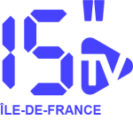

# 15Secondes TV

Création d'une PWA pour le site 15Secondes TV dans le cadre du projet annuel des M2 Développement Web de l'ECV Lille.

Réalisé par Coraly MAGDZIAREK, Pierre BEUSELINCK, DANCUO Lohan, Aubrian DUHAYON





## Demo

[Lien vers 15Secondes TV](https://15secondes.vercel.app)


## Technologies

**Client:** NextJS, TailwindCSS

**Server:** Node


##  Variables d'environnement

Pour lancer le projet vous avez besoin de deux variables d'environnement :

`DATABASE_URL` **Obligatoire**

`NEXT_PUBLIC_ONESIGNAL_APP_ID`


## Installation

Cloner le projet
```
git clone https://github.com/CLAP-ecv/15secondes.git
```

Installer les dépendances avec npm
```bash
  npm install
```

Lancer le serveur de développement
```bash
cd 15secondes
npm run dev
```
    
